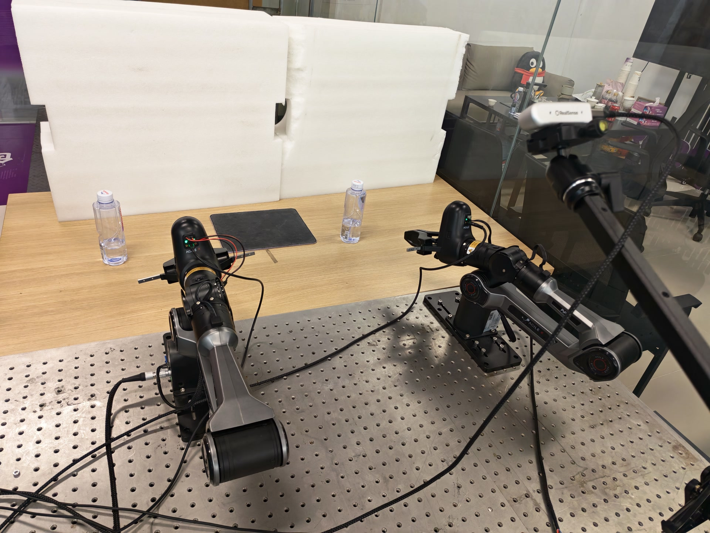
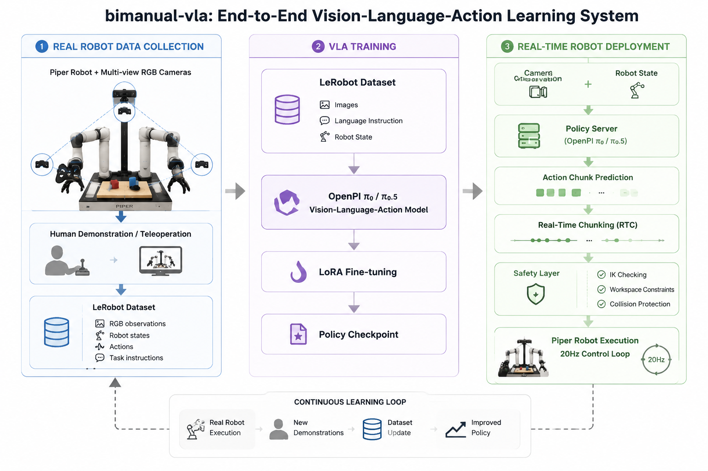
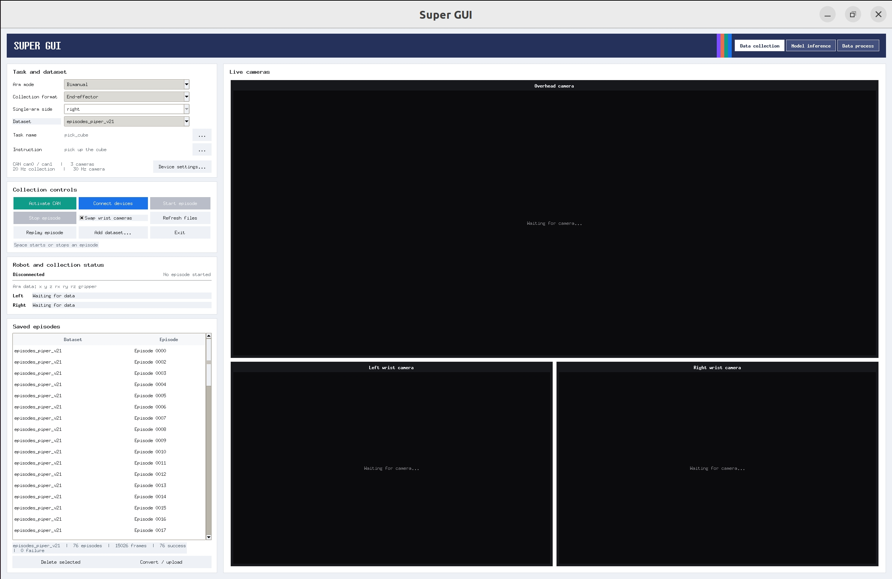
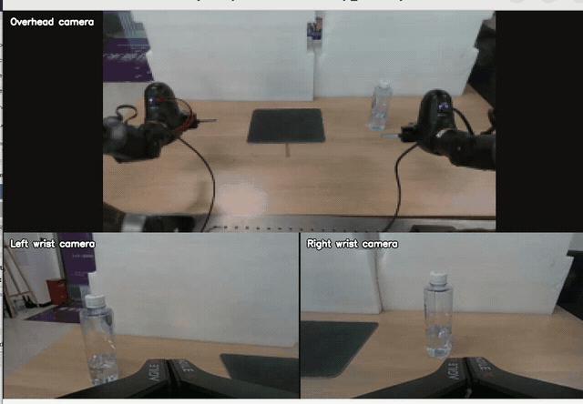
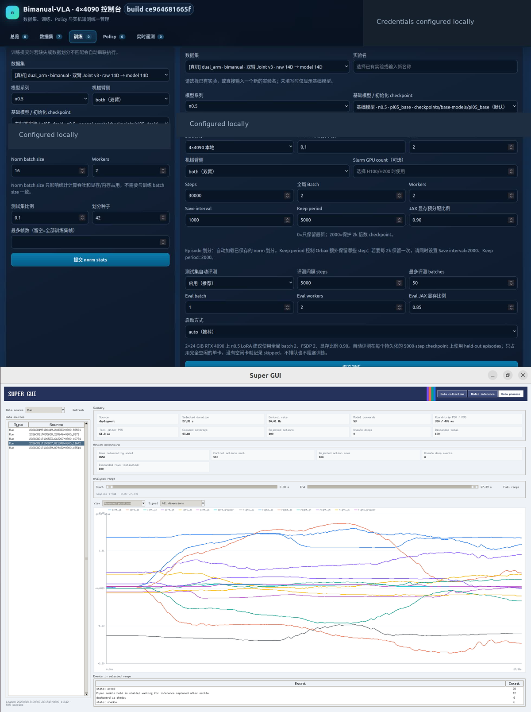

<div align="center">

# bimanual-vla

**End-to-end Piper robot data collection, OpenPI training, and real-time policy deployment**

[](docs/INSTALLATION.md) [](docs/INSTALLATION.md) [](https://github.com/huggingface/lerobot) [](https://github.com/Physical-Intelligence/openpi) [](#real-robot-deployment)

[**Code**](https://github.com/SUNNYsyy2005/bimanual-vla) &nbsp;&middot;&nbsp; [**Documentation**](docs/README.md) &nbsp;&middot;&nbsp; [**Demo**](#demo) &nbsp;&middot;&nbsp; [**Installation**](docs/INSTALLATION.md)

</div>

<p align="center">
  
</p>

## Overview

`bimanual-vla` connects the complete real-robot learning loop in one repository:
collect synchronized Piper demonstrations, validate and export LeRobot datasets,
fine-tune OpenPI `pi0` / `pi0.5` policies, and deploy action chunks through a
latency-aware and safety-gated execution stack.

```text
Piper + RGB Cameras  ->  Robot Demonstrations  ->  LeRobot Dataset
        ->  OpenPI LoRA Fine-tuning  ->  Policy Server
        ->  Real-Time Chunking  ->  Safety Layer  ->  Piper Execution
```

The same workflow supports a single 6-DoF arm or a bimanual system, joint-space
and end-effector-space policies, and both GUI-driven and command-line operation.

## Highlights

- **End-to-end real-robot pipeline** from demonstrations to closed-loop policy execution.
- **Multi-camera Piper collection** with GUI operation, teleoperation, replay, and episode management.
- **LeRobot-compatible data** with versioned contracts, validation, conversion, and upload tools.
- **OpenPI training stack** for `pi0` / `pi0.5` LoRA fine-tuning and optional multi-GPU FSDP.
- **Real-time, safety-aware deployment** with model-side RTC, 20 Hz control, and fail-closed execution.

## System Overview

<p align="center">
  
</p>

The public workflow is organized into three stages. Detailed data contracts,
validation rules, transport fields, and server operations live in
[the documentation](docs/README.md) instead of the project homepage.

| Stage | Input | Core components | Output |
|---|---|---|---|
| Data collection | Piper feedback, RGB views, language instruction | GUI or teleoperation, synchronized recording, episode validation | Raw robot episodes and LeRobot v2.1 datasets |
| VLA training | Images, robot state, actions, task text | OpenPI `pi0` / `pi0.5`, LoRA, optional FSDP | Versioned Policy checkpoints |
| Real-time deployment | Live observation and Policy checkpoint | WebSocket inference, RTC, action queue, safety gates | 20 Hz Piper commands |

## Hardware Setup

### Robot and Sensors

| Component | Configuration |
|---|---|
| Robot | Piper robotic arm, single-arm or bimanual |
| Kinematics | 6 revolute joints per arm plus gripper |
| End effector | Piper gripper, approximately `0.00-0.07 m` opening range |
| Control | Piper SDK over SocketCAN at `1 Mbit/s` |
| Overhead camera | Intel RealSense D435i, third-person RGB view |
| Wrist cameras | Intel RealSense D405, one RGB view per active wrist |
| Collection / control rate | `20 Hz` |
| Camera source rate | Typically `30 FPS` |

Depth is available on the camera hardware but is not part of the current
training contract. Stable `/dev/v4l/by-path` camera selectors are recommended
because `/dev/videoN` indices can change after USB reconnection.

### Compute

| Role | Typical platform | Responsibility |
|---|---|---|
| Robot workstation | Ubuntu 22.04, x86_64 | CAN control, camera capture, GUI, RTC client; left master/slave share `can0`, right master/slave share `can1` |
| Policy and Dashboard server | NVIDIA RTX 4090 workstation | Remote Policy inference, dataset management, telemetry |
| Edge Policy node | NVIDIA Orin NX 16 GB | Parallel local OpenPI inference, no ROS2; maintained on its own branch |
| Local Policy node | NVIDIA RTX 5060, 8 GB | Parallel local OpenPI/SmolVLA inference, no ROS2; see [5060 deployment](docs/deployment/RTX5060_LOCAL_INFERENCE.md) |
| Training cluster | NVIDIA H100 / H200 with Slurm | Fine-tuning and evaluation; finalized weights are copied from NAS to inference nodes |

ROS, ROS2, gRPC, and EtherCAT are not required by the current stack.

## Data Collection

<p align="center">
  
</p>

The collection application provides device discovery, live multi-camera
preview, task metadata, robot feedback, episode controls, replay, and direct
conversion/upload. It supports:

- single-arm and bimanual collection;
- master/slave teleoperation or output-arm feedback recording;
- overhead plus left/right wrist RGB streams;
- `joint` and `delivery` data schemas;
- success/failure labeling and guarded episode publication.

Start the GUI from the robot workstation:

```bash
conda activate dual_arm
bash start_gui.sh
```

For command-line bimanual teleoperation and recording:

```bash
bin/bimanual-vla teleop-bimanual --record --schema joint
```

See the [GUI operation guide](docs/collection/GUI_OPERATION_GUIDE.md) and
[data collection guide](docs/collection/DATA_COLLECTION_GUIDE.md) before
connecting hardware.

## Dataset Pipeline

```text
Raw NPZ Episodes  ->  Contract Validation  ->  LeRobot v2.1
       ->  Dataset Inspection / Merge  ->  OpenPI Training Dataset
```

Each episode combines the signals needed by a vision-language-action policy:

| Signal | Content |
|---|---|
| RGB observations | Overhead view and one or two wrist views |
| Robot state | Joint state or absolute end-effector state |
| Actions | Joint targets or end-effector targets / model deltas |
| Language | Natural-language task instruction |
| Metadata | Timestamps, schema, arm mode, contract version, success label |

Supported v3 action contracts are explicit and versioned:

| Mode | Schema | Observation | Raw action | Model action |
|---|---|---:|---:|---:|
| Single arm | Joint | 7D | 7D | 7D |
| Bimanual | Joint | 14D | 14D | 14D |
| Single arm | Delivery | 10D | 10D | 7D |
| Bimanual | Delivery | 20D | 20D | 14D |

Bimanual vectors always use `left + right` ordering, and the normalized gripper
convention is `0 = closed`, `1 = open`.

```bash
# Validate raw episodes
bin/bimanual-vla data-validate \
  --input-dir episodes_piper_v21 \
  --target-fps 20

# Export successful episodes to LeRobot v2.1
bin/bimanual-vla data-export \
  --input-dir episodes_piper_v21 \
  --repo-id piper/piper_v1 \
  --root lerobot_datasets/piper_v1 \
  --fps 20

# Validate the exported dataset
bin/bimanual-vla data-check lerobot_datasets/piper_v1
```

The authoritative field definitions are documented in the
[Piper data contract](docs/collection/PIPER_DATA_CONTRACT.md).

## VLA Training

The training backend integrates OpenPI `pi0` and `pi0.5` with LoRA fine-tuning.
The Dashboard manages dataset selection, persistent train/test splits,
normalization statistics, training jobs, checkpoints, and held-out evaluation.
FSDP can distribute supported runs across multiple GPUs; H100/H200 jobs are
submitted through Slurm.

```yaml
Input:
  Images: overhead RGB + wrist RGB views
  State: joint 7D/14D or end-effector 10D/20D
  Language: natural-language task instruction

Output:
  Action chunk: 50 x 7D or 50 x 14D
  Execution target: decoded joint/gripper command after safety checks
```

Download an OpenPI base checkpoint with the repository helper:

```bash
python -m scripts.models.download_openpi_checkpoint \
  --checkpoint gs://openpi-assets/checkpoints/pi05_base \
  --source auto \
  --workers 16 \
  --chunks-per-file 16
```

Training and Policy serving use a separate OpenPI Python 3.11 environment. Do
not install the robot workstation requirements over a working JAX/OpenPI
environment. Follow the [installation guide](docs/INSTALLATION.md#9-openpi-policy-and-training-server)
for the pinned upstream revision and server configuration.

## Real-Robot Deployment

```text
Robot Workstation                         Policy Server
-----------------                        -----------------
RGB cameras + Piper state  --WebSocket-> OpenPI pi0 / pi0.5
RTC session and timing      --WebSocket-> Model-side RTC
Action queue + safety       <-WebSocket-- Timestamped action chunk
        |
        +--> 20 Hz validated Piper commands
```

Start the Dashboard/Policy stack on a configured inference server, then run the
robot client in **shadow mode** first:

双臂推理只连接两只从臂/输出臂：左从臂使用 `can0`，右从臂使用 `can1`；主臂只用于主从遥操作采集，不接入 RTC 推理客户端。

```bash
export BIMANUAL_VLA_POLICY_HOST="<policy-server-host>"

bin/bimanual-vla rtc-client \
  --host "$BIMANUAL_VLA_POLICY_HOST" \
  --port 8000 \
  --arm-mode bimanual \
  --arm-side both \
  --left-can can0 \
  --right-can can1 \
  --cam-high-device auto \
  --cam-left-wrist-device auto \
  --cam-right-wrist-device auto \
  --instruction "pick up the cube" \
  --hz 4 \
  --control-hz 20 \
  --rtc-enabled
```

> [!CAUTION]
> Real motion requires both the local `--allow-execution` flag and a non-expired
> Dashboard `EXECUTE` authorization for the same Policy. A stale camera, CAN or
> Policy stream, a contract mismatch, or any failed safety check blocks commands.

The execution layer validates action age and shape, workspace bounds, joint and
gripper changes, IK feasibility, Piper state, and authorization on every control
cycle. RTC is applied inside model denoising; it is not client-side interpolation.
See the [RTC deployment guide](docs/deployment/RTC_CLIENT_GUIDE.md).

## Demo

<p align="center">
  
</p>

The demo presents the bimanual Piper platform during a real manipulation run.

## Dashboard

<p align="center">
  
</p>

The web and desktop interfaces cover dataset/episode management, normalization,
LoRA/FSDP training, checkpoint and Policy lifecycle, live telemetry, action
accounting, trajectory inspection, and evaluation video management.

## Installation

The robot workstation is tested with Ubuntu 22.04 and Python 3.10:

```bash
git clone https://github.com/SUNNYsyy2005/bimanual-vla.git
cd bimanual-vla

conda create -n dual_arm python=3.10.20 -y
conda activate dual_arm
python -m pip install --upgrade pip setuptools wheel
python -m pip install -r requirements.txt

bin/bimanual-vla --help
```

System packages, SocketCAN activation, RealSense selection, OpenPI setup,
Dashboard configuration, Slurm, verification, and troubleshooting are covered
in the [complete installation guide](docs/INSTALLATION.md).

## Project Layout

```text
.
|-- assets/                    # README images and demos
|-- bin/bimanual-vla          # Unified command entry point
|-- bimanual_vla/
|   |-- collection/           # GUI, cameras, teleoperation, robot sessions
|   |-- data/                 # Contracts, validation, export, upload, replay
|   `-- deployment/           # RTC client, Policy adapter, safety execution
|-- server_4090/              # Dashboard backend, frontend, Policy services
|-- docs/                     # Installation, collection, and deployment guides
|-- scripts/                  # Model, maintenance, analysis, and smoke tools
|-- jobs/                     # Slurm and analysis jobs
|-- tests/                    # Automated test suite
`-- requirements.txt          # Robot workstation dependencies
```

Runtime datasets, checkpoints, telemetry, and deployment recordings are not
source code and are excluded from Git.

## Documentation

| Topic | Guide |
|---|---|
| Installation and hardware | [Installation](docs/INSTALLATION.md) |
| Collection GUI | [GUI operation guide](docs/collection/GUI_OPERATION_GUIDE.md) |
| Data collection | [Data collection guide](docs/collection/DATA_COLLECTION_GUIDE.md) |
| Dataset fields and semantics | [Piper data contract](docs/collection/PIPER_DATA_CONTRACT.md) |
| 7D/10D action design | [OpenPI action design](docs/collection/PI05_PIPER_7D_10D_DATA_ACTION_DESIGN.md) |
| Real-robot inference | [RTC client guide](docs/deployment/RTC_CLIENT_GUIDE.md) |
| Dashboard backend | [Dashboard operations](server_4090/README.md) |
| Dashboard API | [API reference](server_4090/API_USAGE.md) |

## Testing

```bash
python -m unittest discover -s tests -v
```

Hardware and Policy smoke tests are available under `scripts/smoke/`. Run them
only in the matching robot or inference-server environment.

## Acknowledgements

This project builds on [OpenPI](https://github.com/Physical-Intelligence/openpi),
[LeRobot](https://github.com/huggingface/lerobot), and the Piper robot SDK.
