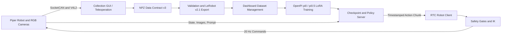

# bimanual-vla README Information Brief

> Status: repository facts collected on 2026-08-24. Confirm every item marked
> `TODO` before publishing. Internal credentials, tokens, passwords, and private
> access URLs must not be added to the public README.

## 1. Project Information

| Item | Content |
|---|---|
| Project name | `bimanual-vla` |
| English subtitle | End-to-end Piper robot data collection, OpenPI training, and real-time policy deployment |
| Chinese summary | 面向 Piper 单臂与双臂机器人的数据采集、数据处理、OpenPI 模型训练和安全实机部署框架 |
| Problem | 将机器人数据采集、协议校验、LeRobot 转换、VLA 微调、远程推理和真机执行整合为一条可管理、可验证的工作流 |
| Paper / report | TODO: 当前仓库没有论文、arXiv 链接、BibTeX 或正式技术报告 |
| License | TODO: 当前仓库没有 License 文件 |
| Authors / organization | TODO |
| Repository URL | `https://github.com/SUNNYsyy2005/bimanual-vla` |

Suggested keywords:

```text
Piper, Bimanual Manipulation, Vision-Language-Action, OpenPI, pi0.5,
LeRobot, Real-Time Chunking, Robot Learning, Real-Robot Deployment
```

## 2. One-Sentence Introduction

English:

> An end-to-end framework for collecting Piper robot demonstrations, preparing
> LeRobot datasets, fine-tuning OpenPI policies, and deploying action-chunking
> VLA models on real single-arm and bimanual systems.

中文：

> 一套覆盖 Piper 单臂/双臂数据采集、LeRobot 数据处理、OpenPI 模型微调、
> 实时分块推理与安全真机执行的端到端机器人学习框架。

## 3. Project Highlights

- Complete workflow from real-robot data collection to policy execution.
- GUI-based single-arm and bimanual collection with synchronized RGB cameras.
- Versioned Piper data contracts for joint-space and end-effector-space policies.
- LeRobot v2.1 export, validation, resumable upload, merge, and episode management.
- OpenPI `pi0` / `pi0.5` LoRA fine-tuning on RTX 4090, H100, and H200 systems.
- Real-Time Chunking at the model denoising stage for latency-aware action continuity.
- Independent 20 Hz control and asynchronous policy inference loops.
- Fail-closed execution with local permission, time-limited Dashboard authorization,
  contract validation, workspace limits, IK checks, and Piper state checks.
- Web Dashboard for datasets, normalization, training, checkpoints, policies,
  telemetry, evaluation videos, and Slurm resource management.

## 4. System Architecture



Module responsibilities:

| Module | Responsibility |
|---|---|
| `bimanual_vla.collection` | Camera discovery, GUI, teleoperation, Piper feedback, episode recording, and homing safeguards |
| `bimanual_vla.data` | Data contracts, validation, analysis, replay, LeRobot export, and Dashboard upload |
| `bimanual_vla.deployment` | OpenPI WebSocket client, Real-Time Chunking, action queues, safety execution, and deployment recording |
| `server_4090` | Dashboard frontend/backend, dataset management, training, evaluation, checkpoint, Policy, and telemetry services |
| `scripts` | Maintenance, model preparation, diagnostics, analysis, and smoke tests |
| `jobs` | Slurm jobs and action-statistics analysis |

## 5. Hardware Setup

### Robot

| Item | Configuration |
|---|---|
| Robot | Piper robotic arm; exact commercial model/SKU: TODO |
| Modes | Single arm and bimanual |
| Degrees of freedom | 6 revolute joints per arm, plus gripper |
| End effector | Piper gripper, approximately `0.00-0.07 m` opening range |
| SDK | `piper_sdk 0.6.1` |
| Control interface | SocketCAN through `piper_sdk.C_PiperInterface_V2` |
| CAN bitrate | `1,000,000 bit/s` |
| Control frequency | `20 Hz` |
| Typical bimanual mapping | Left arm `can0`, right arm `can1`; verify after connecting hardware |
| Master/slave teleoperation | Up to four CAN interfaces: `can0` to `can3` |

### Sensors

| Role | Device | Current use |
|---|---|---|
| Overhead camera | Intel RealSense D435i | Third-person RGB observation |
| Left wrist camera | Intel RealSense D405 | Left wrist RGB observation |
| Right wrist camera | Intel RealSense D405 | Right wrist RGB observation |
| Source stream | V4L2 RGB/YUYV/MJPEG | Typically `424 x 240 @ 30 FPS` |
| Dataset image | RGB `uint8` | `256 x 256`, HWC |
| Depth | Available on camera hardware | Not used by the current dataset contract |

Stable `/dev/v4l/by-path` selectors are preferred because `/dev/videoN` numbers
may change after USB reconnection.

### Computing

| Role | OS | CPU | RAM | GPU |
|---|---|---|---:|---|
| Robot control workstation | Ubuntu 22.04.2 | Intel Core Ultra 9 275HX, 24 logical CPUs | 30 GiB | RTX 5060 Laptop, 8 GB |
| Policy/Dashboard server | Ubuntu 22.04.5 | Intel Xeon Platinum 8358P, 128 logical CPUs | 125 GiB | 4 x RTX 4090, 24 GB each |
| H100 training node | Ubuntu 22.04 | TODO: CPU/RAM | TODO | NVIDIA H100 |
| H200 training nodes | Alibaba Cloud Linux 3 | TODO: CPU/RAM | TODO | NVIDIA H200 |

### Communication

- SocketCAN: robot state and command transport.
- V4L2/OpenCV: camera capture.
- OpenPI WebSocket protocol: robot observation and policy action chunks.
- HTTP REST: Dashboard management, upload, training, evaluation, and telemetry.
- SSH/rsync: server deployment and controlled file synchronization.
- Slurm: H100/H200 training and evaluation jobs.
- ROS/ROS2, gRPC, and EtherCAT are not used by the current repository.

## 6. Software Environment

### Robot Control Workstation

```yaml
OS: Ubuntu 22.04.2 LTS
Python: 3.10.20
PyTorch: 2.7.1
LeRobot: 0.3.3
OpenPI Client: 0.1.0
Piper SDK: 0.6.1
NumPy: 2.2.6
SciPy: 1.15.3
OpenCV: 4.10.0.84
Pillow: 12.3.0
python-can: 4.6.1
websockets: 15.0.1
CUDA toolkit: not installed in PATH
NVIDIA driver: 580.142
ROS: not used
```

### Policy and Training Systems

```yaml
Policy server:
  OS: Ubuntu 22.04.5 LTS
  Python: 3.11.15
  Environment: openpi
  PyTorch: 2.13.0+cu130

RoboTwin evaluation:
  Python: 3.10.20 or 3.11.15
  PyTorch: 2.4.1+cu121
  CUDA: 12.1
  Dependencies: SAPIEN, mplib, cuRobo, Open3D

H100 training:
  OS: Ubuntu 22.04
  CUDA: 12.8

H200 training:
  OS: Alibaba Cloud Linux 3
  CUDA: 13.0
```

The repository now provides a pinned robot-workstation dependency manifest in
`requirements.txt` and a complete setup guide in `docs/INSTALLATION.md`.
OpenPI/JAX and RoboTwin/cuRobo remain separate host-specific environments.

## 7. Project Structure

The raw `tree -L 2` output contains local ignored datasets and monitoring runs.
The source-oriented structure suitable for the public README is:

```text
bimanual-vla/
├── bimanual_vla/
│   ├── collection/       # GUI, cameras, teleoperation, robot control
│   ├── data/             # Contracts, validation, export, upload, replay
│   └── deployment/       # RTC client, RTC policy, deployment recording
├── bin/
│   └── bimanual-vla     # Unified command-line entry point
├── server_4090/          # Dashboard frontend/backend and Policy management
├── scripts/              # Model, maintenance, analysis, and smoke tools
├── jobs/                 # Slurm and statistics jobs
├── docs/                 # Collection and deployment documentation
├── tests/                # Automated tests
├── deploy_4090_server.sh
├── start_gui.sh
└── README.md
```

Local runtime directories such as `episodes_piper_v21/`, `lerobot_datasets/`,
`deployment_runs/`, and `monitoring_data/` are excluded from Git.

## 8. Data Collection

### Start the GUI

```bash
cd ~/dual_ARM_project/arm_collect/bimanual-vla
conda activate dual_arm
bash start_gui.sh
```

Collection workflow:

1. Verify `can0`/`can1` and all RGB camera streams.
2. Select single-arm or bimanual mode and `joint` or `delivery` schema.
3. Set the dataset directory, task name, and language instruction.
4. Click `Connect devices` and verify live robot/camera feedback.
5. Click `Start Episode`, complete one task attempt, and click `Stop Episode`.
6. Select `Save as Success`, `Save as Failure`, or `Discard`.
7. Replay representative episodes before export.

Saved files use:

```text
episodes_piper_v21/
├── ep_0000.npz
├── ep_0001.npz
└── .trash/
```

Deleted episodes are moved to `.trash/` instead of being permanently erased.

### Command-Line Collection

```bash
# Bimanual master/slave collection
bin/bimanual-vla teleop-bimanual --record --schema joint

# Single-arm master/slave collection
bin/bimanual-vla teleop-single --arm-side right --record --schema joint

# Output-arm feedback collection
bin/bimanual-vla collect-output \
  --arm-mode single \
  --arm-side right \
  --schema joint \
  --can can0 \
  --task-name pick_cube \
  --instruction "pick up the cube"
```

## 9. Data Contract

### Contract Matrix

| Mode | Schema | Observation state | Raw action | Model/wire action |
|---|---|---:|---:|---:|
| Single arm | Joint v3 | 7D | 7D | 7D |
| Bimanual | Joint v3 | 14D | 14D | 14D |
| Single arm | Delivery v3 | 10D | 10D | 7D |
| Bimanual | Delivery v3 | 20D | 20D | 14D |

Bimanual vectors always use `left + right` ordering.

Joint state per arm:

```text
[joint_1_rad, ..., joint_6_rad, gripper_opening_fraction]
```

Delivery state/raw target per arm:

```text
[eef_xyz_in_slave_base,
 rotation_6d,
 gripper_opening_fraction]
```

Delivery model action per arm:

```text
[delta_xyz_from_current,
 rotation_vector_from_current,
 absolute_gripper_target]
```

The gripper convention is `0 = closed`, `1 = open`. A model action chunk is
anchored to one current observation; future rows are not accumulated as
neighbor-to-neighbor deltas.

### Raw NPZ Example

```text
ep_XXXX.npz
├── state                              float32 (T, 10 or 20)
├── actions                            float32 (T, 10 or 20)
├── joint_qpos                         float32 (T, 7 or 14)
├── state_timestamp                    float64 (T,)
├── action_timestamp                   float64 (T,)
├── images_cam_high                    uint8 (T, 256, 256, 3)
├── images_cam_left_wrist              uint8 (T, 256, 256, 3), bimanual
├── images_cam_right_wrist             uint8 (T, 256, 256, 3)
├── image_timestamps_<camera>          float64 (T,)
├── task_name / instruction / success  scalar
└── contract metadata                  scalar fields
```

Default collection rate is `20 Hz`, camera source rate is `30 FPS`, and the
default action horizon is 50 steps.

## 10. Data Processing

```bash
# Validate raw episodes
bin/bimanual-vla data-validate \
  --input-dir episodes_piper_v21 \
  --target-fps 20

# Export successful episodes to LeRobot v2.1
bin/bimanual-vla data-export \
  --input-dir episodes_piper_v21 \
  --repo-id piper/piper_v1 \
  --root lerobot_datasets/piper_v1 \
  --fps 20

# Validate the exported dataset
bin/bimanual-vla data-check lerobot_datasets/piper_v1

# Upload to the Dashboard
bin/bimanual-vla data-upload lerobot_datasets/piper_v1 \
  --name piper_v1 \
  --dataset-origin real \
  --server "$BIMANUAL_VLA_DASHBOARD_URL" \
  --token "$BIMANUAL_VLA_SERVER_TOKEN" \
  --workers 4 \
  --merge
```

The validator checks shapes, dtypes, timestamps, FPS, image synchronization,
rotation-6D validity, action alignment, NaN/Inf, frozen frames, no-op ratios,
and gripper coverage.

## 11. Model Training

### Base Models

- OpenPI `pi0.5`, the current primary model.
- OpenPI `pi0`, supported by the Dashboard.
- LoRA fine-tuning with optional FSDP across multiple GPUs.

### Inputs and Outputs

```yaml
Input:
  Images: overhead RGB plus one or two wrist RGB views
  State: joint 7D/14D or EEF 10D/20D
  Language: natural-language task instruction

Output:
  Joint policy: 50 x 7D or 50 x 14D action chunk
  Delivery policy: 50 x 7D or 50 x 14D model action chunk
  Execution: absolute Piper joint/gripper targets after decoding and safety checks
```

### Dashboard Training Workflow

1. Upload and validate a LeRobot dataset.
2. Select `pi0.5` or `pi0` and a compatible base checkpoint.
3. Create and persist the episode train/test split.
4. Compute normalization statistics.
5. Start LoRA/FSDP training locally or through Slurm.
6. Monitor loss, gradient, parameter, and held-out evaluation metrics.
7. Select a complete checkpoint containing `params/` and
   `_CHECKPOINT_METADATA`.

Representative direct OpenPI command:

```bash
$ENV/bin/python -u scripts/train.py \
  pi05_put_bottles_dustbin_piper_lora_100_25hz_realqpos_v3_order_aligned \
  --exp-name pi05-put-bottles-v3 \
  --batch-size 32 \
  --num-workers 8 \
  --num-train-steps 30000 \
  --save-interval 5000 \
  --keep-period 10000 \
  --fsdp-devices 2 \
  --no-wandb-enabled
```

Formal H100/H200 training must be submitted through Slurm. The Dashboard API
is the preferred orchestration interface.

## 12. Real-Robot Deployment

### Deployment Topology

```text
Robot Workstation
  ├── Piper CAN feedback and command
  ├── RGB camera capture
  └── OpenPI WebSocket client
             ↓
4 x RTX 4090 Policy Server
  ├── pi0/pi0.5 checkpoint
  ├── model-side Real-Time Chunking
  └── timestamped action chunks
             ↓
Robot Workstation
  └── queue, safety gates, IK, and 20 Hz execution
```

The Dashboard manages processes and mirrors telemetry. Real observations and
inference requests travel directly between the robot client and the Policy
WebSocket server.

### Start the Dashboard

```bash
bash deploy_4090_server.sh
```

The deployment installs and starts the user-level
`bimanual-vla-dashboard.service`. Configure the public/private Dashboard URL
outside the README instead of committing credentials.

### Start a Policy

Use the Dashboard Policy page or `POST /api/tasks/policy` to select:

- dataset contract;
- model family;
- checkpoint;
- GPU;
- WebSocket port;
- default instruction;
- RTC settings.

### Shadow Mode

```bash
bin/bimanual-vla rtc-client \
  --host "$BIMANUAL_VLA_POLICY_HOST" \
  --port 8000 \
  --arm-mode bimanual \
  --arm-side both \
  --left-can can0 \
  --right-can can1 \
  --cam-high-device auto \
  --cam-left-wrist-device auto \
  --cam-right-wrist-device auto \
  --instruction "pick up the cube" \
  --hz 4 \
  --control-hz 20 \
  --rtc-enabled
```

### Real Execution

Add local execution permission:

```bash
bin/bimanual-vla rtc-client \
  --host "$BIMANUAL_VLA_POLICY_HOST" \
  --port 8000 \
  --arm-mode bimanual \
  --arm-side both \
  --left-can can0 \
  --right-can can1 \
  --cam-high-device auto \
  --cam-left-wrist-device auto \
  --cam-right-wrist-device auto \
  --instruction "pick up the cube" \
  --hz 4 \
  --control-hz 20 \
  --rtc-enabled \
  --allow-execution
```

`--allow-execution` alone does not move the robot. The Dashboard must also
grant a non-expired `EXECUTE` authorization to the same Policy. Any stale
feedback, contract mismatch, unsafe target, IK failure, workspace violation,
expired authorization, or disconnected Policy causes fail-closed behavior.

## 13. Evaluation Results

The repository currently contains only small-sample RoboTwin diagnostics. They
must not be presented as a formal overall success rate.

| Checkpoint / configuration | Seed 100002 | Seed 100013 | Diagnostic result |
|---|---:|---:|---:|
| RTX 4090 cp5000, `pi0_step=10` | Fail | Fail | 0/2 |
| RTX 4090 cp5000, `pi0_step=50` | Success | Fail | 1/2 |
| H200 cp10000, `max_delta=0.12`, no blend | Fail | Fail | 0/2 |
| H200 cp10000, `max_delta=0.08`, no blend | Fail | Success | 1/2 |
| H200 cp10000, `max_delta=0.10`, no blend | Fail | Fail | 0/2 |
| H200 cp10000, `max_delta=0.08`, blend 5 | Fail | Fail | 0/2 |

TODO for a publishable benchmark:

- define test tasks and object/scene variations;
- run enough independent trials per method;
- report success criteria and confidence intervals;
- report average completion time and inference latency;
- compare against a clearly defined baseline;
- separate simulation and real-robot results;
- publish representative success and failure videos.

## 14. Existing Data and Media Inventory

Local ignored data found during collection:

| Resource | Current inventory | Publication status |
|---|---:|---|
| Raw NPZ episodes | 281 active episodes plus 11 in `.trash` | Not tracked; review contracts and labels |
| Local LeRobot datasets | 83 episodes, 18,034 frames, 20 FPS | Legacy delivery format; not tracked |
| Deployment recordings | 5 bimanual runs | Not tracked |
| Camera videos | 15 MP4 files, three views per run | `256 x 256 @ 30 FPS`, 24.4-42.6 seconds |
| Tracked README media | None | Hero, diagrams, GIFs, and demo videos are missing |

Candidate local demo sources are under:

```text
deployment_runs/<run-id>/videos/
├── cam_high.mp4
├── cam_left_wrist.mp4
└── cam_right_wrist.mp4
```

Review every recording for privacy, task correctness, and robot safety before
publishing it.

## 15. Required README Media

- [ ] Hero image showing the complete bimanual Piper setup.
- [ ] System architecture diagram.
- [ ] Data-collection GUI screenshot.
- [ ] Overhead and wrist-camera collection montage.
- [ ] Dashboard dataset/training/Policy screenshot.
- [ ] Real-robot deployment photo.
- [ ] Successful real-robot demo GIF.
- [ ] Simulation rollout GIF or video.
- [ ] Training/evaluation result plot.
- [ ] Baseline comparison figure.

Recommended public asset layout:

```text
assets/
├── hero.jpg
├── architecture.png
├── collection_gui.png
├── dashboard.png
├── data_pipeline.png
├── demo_real_robot.gif
├── demo_simulation.gif
└── results.png
```

## 16. Installation Status

The public installation entry points are now:

- `requirements.txt`: pinned collection, data, Dashboard, Piper, and RTC client dependencies;
- `docs/INSTALLATION.md`: Ubuntu packages, Conda setup, CAN, cameras, OpenPI,
  Dashboard, Slurm, RoboTwin, verification, and troubleshooting.

Remaining validation work:

- [ ] reproduce `requirements.txt` in a clean Python 3.10 environment;
- [ ] verify CAN activation and all three cameras on a second robot workstation;
- [ ] package the project with `pyproject.toml` for installable console scripts;
- [ ] publish the custom Piper/OpenPI training-config installation procedure;
- [ ] validate the complete Policy server setup on a clean GPU host.

## 17. Publication Checklist

- [x] Project introduction collected.
- [x] System modules and data flow collected.
- [x] Current robot, camera, control workstation, and Policy server identified.
- [x] Current software environments identified.
- [x] Source-oriented directory tree prepared.
- [x] Data collection and dataset contract documented.
- [x] Training and deployment workflows documented.
- [x] Existing diagnostic results recorded with limitations.
- [x] Existing local media inventory identified.
- [x] Add pinned robot-workstation requirements and an installation guide.
- [ ] Confirm exact Piper model/SKU.
- [ ] Confirm project authors and organization.
- [ ] Choose and add a License.
- [ ] Add paper/report and Citation, or explicitly state that none exists.
- [ ] Reproduce the documented installation on clean robot and GPU hosts.
- [ ] Run a formal benchmark and publish complete results.
- [ ] Select, edit, and commit public images/GIFs/videos.

## 18. Evidence Sources

- `README.md`
- `docs/collection/DATA_COLLECTION_GUIDE.md`
- `docs/collection/GUI_OPERATION_GUIDE.md`
- `docs/collection/PIPER_DATA_CONTRACT.md`
- `docs/collection/PI05_PIPER_7D_10D_DATA_ACTION_DESIGN.md`
- `docs/deployment/RTC_CLIENT_GUIDE.md`
- `docs/deployment/SERVER_PATHS_ENV_TRAIN_EVAL.md`
- `server_4090/README.md`
- `server_4090/API_USAGE.md`
- `server_4090/SIMULATION_DASHBOARD.md`
- Source defaults and local read-only hardware/environment inspection performed
  on 2026-08-24.
